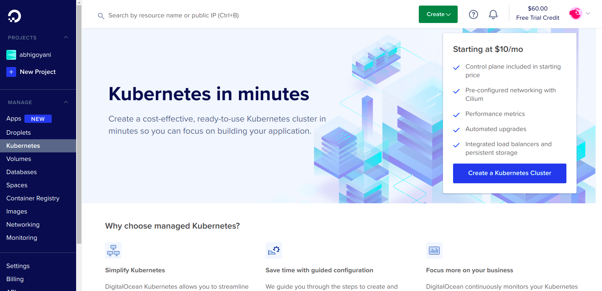
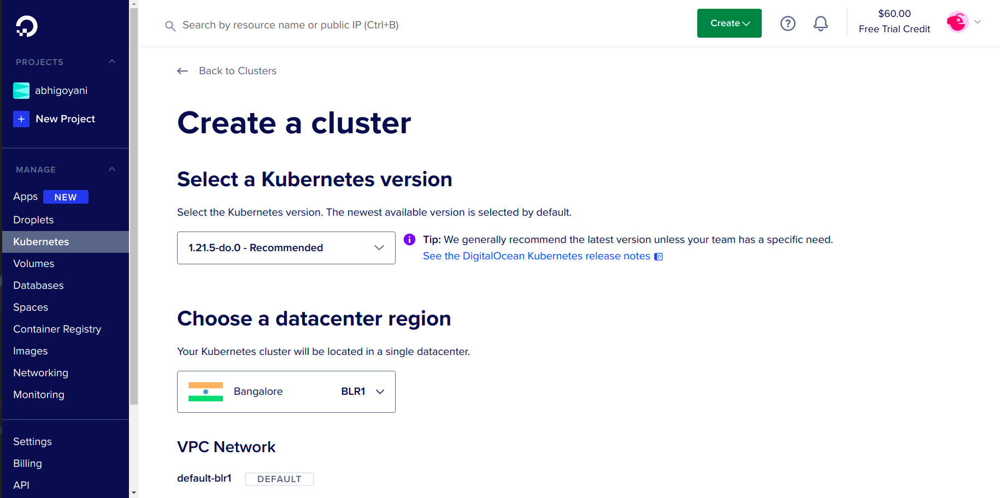
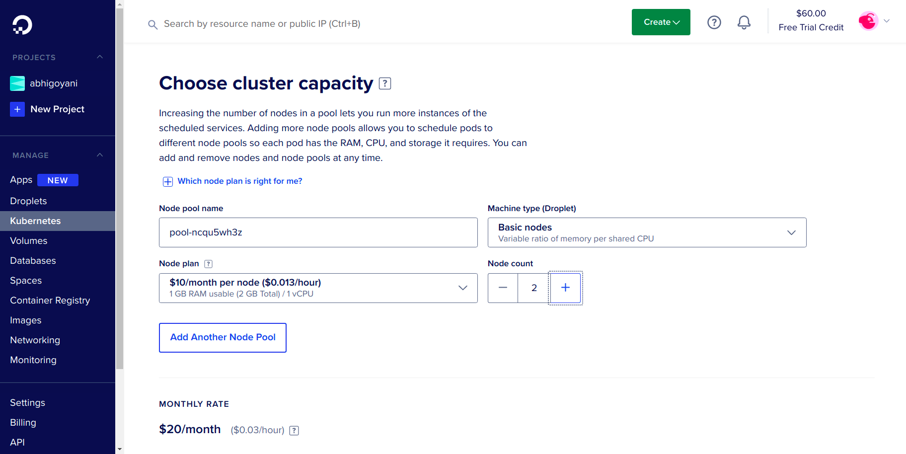
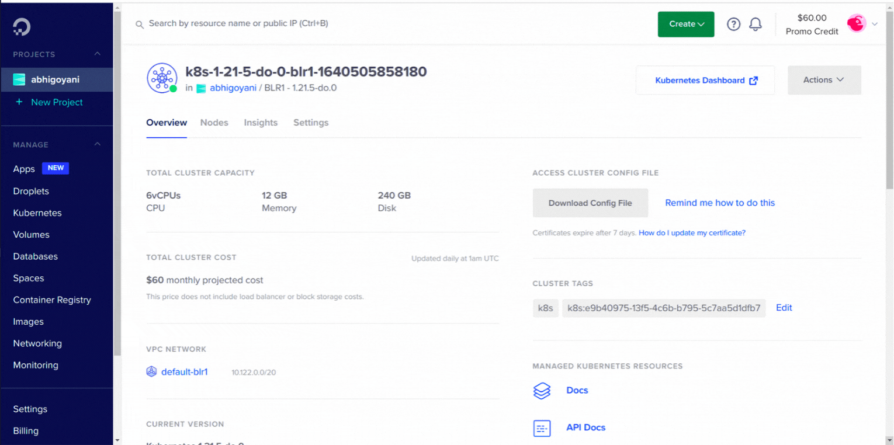
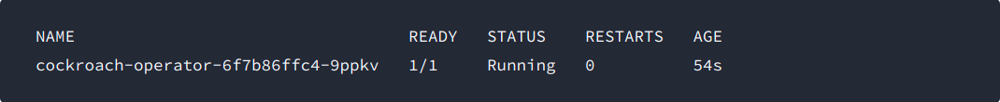
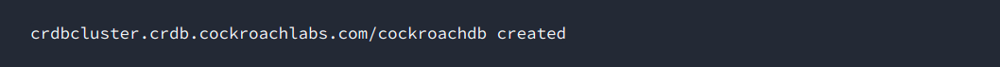
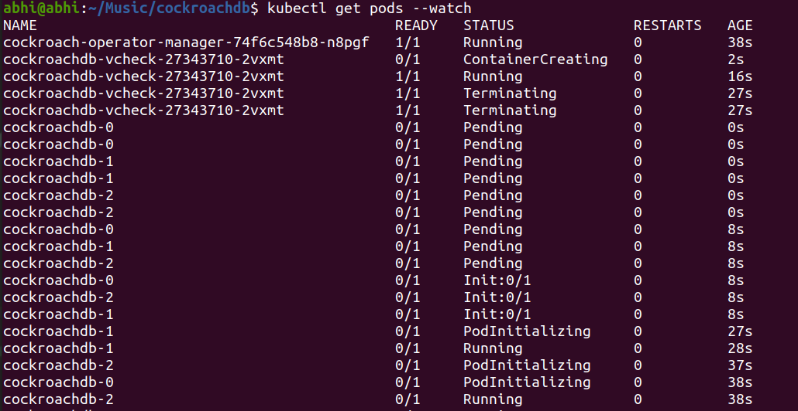
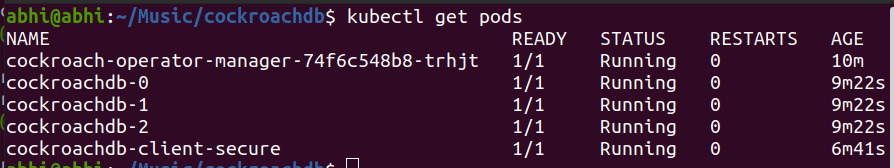
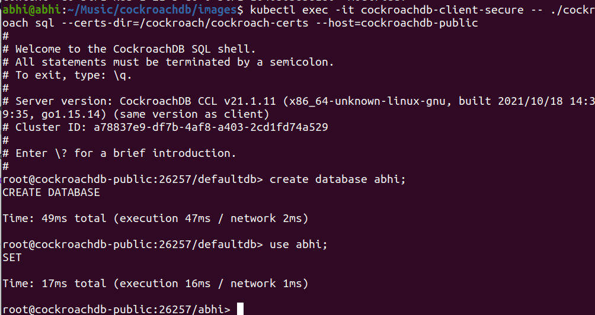

For the [DigitalOcean](https://digitalocean.com/) [Kubernetes](https://kubernetes.io/) Challenge, I wanted to deploy a database to a managed Kubernetes cluster, and decided to go with [CockroachDB](https://www.cockroachlabs.com/).

# Deploy CockroachDB in Kubernetes Cluster

You can easily deploy CockroachDB highly scalabale cluster on DigitalOcean Kubernetes Platform.
Some prerequisites:
- Git installed on your system
- [kubectl](https://kubernetes.io/docs/tasks/tools/) commandline tool installed

In the dashboard go to kubernetes section.

Select create new cluster

Fill out the form and your cluster will be setup within few minuites.

  
This is it. It is so simple to create a kubernetes cluster in DigitalOcean. Now we will setup CockroachDB in our cluster.

## Connecting to K8s Cluster

After the successful creation of the cluster, you will be greeted with a panel like this, Download the config file from the dashbord:




Export the path of the config file to the KUBECONFIG environment variable:

```sh
export KUBECONFIG=kube_config_cluster.yml
```

## Deploy CockroachDB in Kubernetes Cluster

Apply the [custom resource definition (CRD)](https://kubernetes.io/docs/concepts/extend-kubernetes/api-extension/custom-resources/#customresourcedefinitions) for the Operator:


```sh
kubectl apply -f https://raw.githubusercontent.com/cockroachdb/cockroach-operator/v2.4.0/install/crds.yaml
```

you will see somthing like this
```sh
customresourcedefinition.apiextensions.k8s.io/crdbclusters.crdb.cockroachlabs.com created
```

To use default namespace settings for operator apply operator.yaml file.

```sh
kubectl apply -f https://raw.githubusercontent.com/cockroachdb/cockroach-operator/v2.4.0/install/operator.yaml
```

Set your current namespace to use `cockroach-operator-system`. 
```sh
kubectl config set-context --current --namespace=cockroach-operator-system
```

Validate that the Operator is running:
```sh
kubectl get pods
```



## Initialize the cluster

Download example.yaml, a custom resource that tells the Operator how to configure the Kubernetes cluster.

```sh
curl -O https://raw.githubusercontent.com/cockroachdb/cockroach-operator/v2.4.0/examples/example.yaml
```

Apply `example.yaml`:
kubectl apply -f example.yaml


Check that the pods were created:

```sh
kubectl get pods --watch
```


wait until you all pods are ready


## Use the built-in SQL client

To use the CockroachDB SQL client, first launch a secure pod running the `cockroach` binary.

```sh
kubectl create -f https://raw.githubusercontent.com/cockroachdb/cockroach-operator/master/examples/client-secure-operator.yaml
```

Get a shell into the pod and start the CockroachDB

```sh
kubectl exec -it cockroachdb-client-secure \
-- ./cockroach sql \
--certs-dir=/cockroach/cockroach-certs \
--host=cockroachdb-public
```


